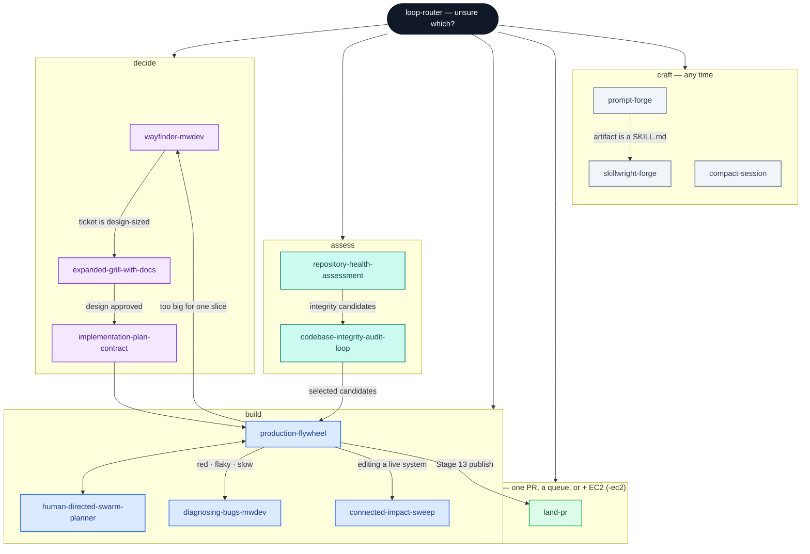

<p align="center">
  <picture>
    <source media="(prefers-color-scheme: dark)" srcset=".github/readme/hero-dark.svg">
    
  </picture>
</p>

<p align="center">
  <strong>A curated operating system for agentic software delivery.</strong><br/>
  <sub>One catalog for capability routing, reusable execution loops, and the contracts they share.</sub>
</p>

<p align="center">
  <a href="https://github.com/markwuenschel-dev/markdev-skills"></a>
  
  
  
</p>

<p align="center">
  <a href="CAPABILITY-MAP.md"></a>
</p>

<p align="center">
  <a href="#get-started">Get started</a> ·
  <a href="CAPABILITY-MAP.md">Capability map</a> ·
  <a href="#install">Install</a> ·
  <a href="DEPENDENCIES.md">Lineage & dependencies</a>
</p>

---

`markdev-skills` is the canonical inventory for a focused set of agent skills: each package owns one clear job, shared contracts stay centralized, and `loop-router` helps choose the right entry point when the work is ambiguous.

Every in-repo skill lives under `skills/` with a root `SKILL.md`. External companions are recorded in [`DEPENDENCIES.md`](DEPENDENCIES.md), not copied in wholesale.

## Get started

1. **Unsure where to begin?** Start with [`loop-router`](skills/loop-router/), then follow its single recommended path.
2. **Know the work?** Use the map below to jump directly to the right skill.
3. **Want the catalog locally?** Follow the [installation instructions](#install) to link or copy every package into your agent skill directory.

> The repository favors explicit boundaries: design before delivery, proof before landing, and shared contracts over duplicated rules.

---

## Explore the capability map


### Decide

| Need | Skill |
| :--- | :--- |
| Chart a big, foggy effort as a durable decision map | [`wayfinder-mwdev`](skills/wayfinder-mwdev/) |
| Shape one design / approved design package | [`expanded-grill-with-docs`](skills/expanded-grill-with-docs/) |
| Turn selected work into a binding execution contract | [`implementation-plan-contract`](skills/implementation-plan-contract/) |
| Unsure which applies | [`loop-router`](skills/loop-router/) |

### Assess

| Need | Skill |
| :--- | :--- |
| Grade repository health, establish a baseline | [`repository-health-assessment`](skills/repository-health-assessment/) |
| Audit and repair codebase integrity, one loop per candidate | [`codebase-integrity-audit-loop`](skills/codebase-integrity-audit-loop/) |

### Build

| Need | Skill |
| :--- | :--- |
| Deliver an approved queue end-to-end | [`production-flywheel`](skills/production-flywheel/) |
| Parallelize a known mission into agent lanes | [`human-directed-swarm-planner`](skills/human-directed-swarm-planner/) |
| Diagnose a hard bug or performance regression | [`diagnosing-bugs-mwdev`](skills/diagnosing-bugs-mwdev/) |
| Change code without leaving the system incoherent | [`connected-impact-sweep`](skills/connected-impact-sweep/) |

### Land

| Need | Skill |
| :--- | :--- |
| Land one change, or an explicit PR queue | [`land-pr`](skills/land-pr/) |
| Same, plus release the affected service(s) to EC2 | [`land-pr`](skills/land-pr/) with `-ec2` |

### Craft

| Need | Skill |
| :--- | :--- |
| Write / repair / optimize a prompt | [`prompt-forge`](skills/prompt-forge/) |
| Design, audit, or harden a SKILL.md package | [`skillwright-forge`](skills/skillwright-forge/) |
| Checkpoint a long session before `/clear` | [`compact-session`](skills/compact-session/) |

**Start here for routing and handoffs:** [`CAPABILITY-MAP.md`](CAPABILITY-MAP.md)  
**External dependencies and lineage:** [`DEPENDENCIES.md`](DEPENDENCIES.md)

---

## How it’s organized

| | |
| :--- | :--- |
| **`skills/`** | One folder per skill — composable, invokable; inventory = every folder with a root `SKILL.md` |
| **`shared/`** | Contracts used across skills — scoring, ledgers, decisions, loop state |
| **`tests/`** | Trigger, boundary, and functional checks |
| **`scripts/`** | Install helpers |

```
markdev-skills/
├── CAPABILITY-MAP.md          ← memory / routing
├── DEPENDENCIES.md            ← externals + fork lineage, pinned by source
│
├── skills/
│   ├── loop-router/
│   │
│   ├── wayfinder-mwdev/                    ← decide
│   ├── expanded-grill-with-docs/
│   ├── implementation-plan-contract/
│   │
│   ├── repository-health-assessment/       ← assess
│   ├── codebase-integrity-audit-loop/
│   ├── improve-codebase-architecture-mwdev/  ← deprecated alias, see Forks
│   │
│   ├── production-flywheel/                ← build
│   ├── human-directed-swarm-planner/
│   ├── diagnosing-bugs-mwdev/
│   ├── connected-impact-sweep/
│   │
│   ├── land-pr/                            ← land (queue + EC2 via flags)
│   │
│   ├── prompt-forge/                       ← craft
│   ├── skillwright-forge/
│   ├── compact-session/
│   │
│   └── agent-executor-pool/                ← mechanism (not directly invocable)
│       used by repository-health-assessment for bounded worker scheduling
│
├── shared/
│   ├── candidate-ledger-spine/   ← family scoring spine (schema + verifiers)
│   ├── evidence-recon/           ← generic evidence packet contract (inline/expedition modes)
│   ├── assessment-acceleration/  ← scheduling, cache, performance receipts
│   ├── REPORT-SCORING.md
│   ├── REQUIREMENTS-LEDGER.md
│   ├── ROLLOUT-CONTRACT.md
│   ├── SWARM-LANES.md
│   ├── HUMAN-DECISIONS.md
│   └── LOOP-STATE.md
│
├── tests/
└── scripts/
```

Skills own their procedure. Shared contracts own rubrics once — skills link in; they don’t fork copies.

---

## Forks

Three skills are **derivative works** of [Matt Pocock's](https://github.com/mattpocock/skills) originals, kept under a `-mwdev` suffix so an upstream update can never overwrite them:

| Fork | Upstream parent |
| :--- | :--- |
| [`wayfinder-mwdev`](skills/wayfinder-mwdev/) | `wayfinder` (forked at v2.1.2) |
| [`diagnosing-bugs-mwdev`](skills/diagnosing-bugs-mwdev/) | `diagnosing-bugs` |
| [`improve-codebase-architecture-mwdev`](skills/improve-codebase-architecture-mwdev/) † | `improve-codebase-architecture` |

† **Deprecated.** `improve-codebase-architecture-mwdev` is now a legacy compatibility alias — it owns no protocol of its own. Route architecture-improvement work to `architecture-improvement-intelligence` instead, which is not yet vendored in this repo (see [`DEPENDENCIES.md`](DEPENDENCIES.md)).

A fork must set its frontmatter `name` to the **suffixed** directory name — `name` is the invocation name, so a fork keeping the upstream `name` collides with the skill it forked and neither resolves reliably. See [`DEPENDENCIES.md`](DEPENDENCIES.md) for lineage and attribution.

---

## Install

Symlinks (or copies) **every** skill under `skills/` that has a root `SKILL.md` into your agent skills directory.

**Bash / macOS / Linux / Git Bash**

```bash
./scripts/install-skills.sh
./scripts/install-skills.sh --dest "$HOME/.agents/skills"
./scripts/install-skills.sh --with-shared
```

**Windows PowerShell**

```powershell
.\scripts\install-skills.ps1
.\scripts\install-skills.ps1 -Dest "$HOME\.agents\skills" -WithShared
```

Default destination: `~/.agents/skills`. Use `--with-shared` / `-WithShared` when contracts need to sit next to the install root.

---

## Rules

| | |
| :---: | :--- |
| **1** | Living inventory — every `skills/*/SKILL.md` is first-class; keep packages flat (no `name/name/` nesting) |
| **2** | Pin true externals in `DEPENDENCIES.md` (source · path · version/commit); do not dump unrelated skill universes here |
| **3** | Change shared rubrics under `shared/`, not per skill |
| **4** | A `-mwdev` fork renames its frontmatter `name` to match its directory, and its upstream parent is credited in `DEPENDENCIES.md` |
| **5** | Keep the public catalog focused, attributable, and coherent as the inventory evolves |

---

<p align="center">
  <sub>Focused catalog · explicit boundaries · proof-driven delivery</sub>
</p>
