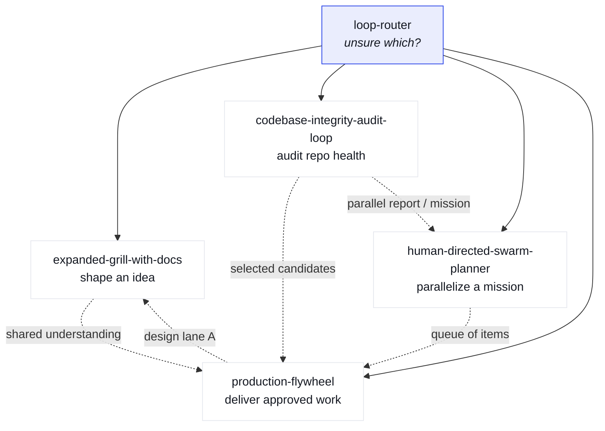

# markdev-skills

<p align="center">
  <strong>Canonical inventory</strong> for five top-level agent skills<br/>
  and the shared contracts they all obey.
</p>

<p align="center">
  <code>private</code>&nbsp;·&nbsp;
  hybrid Matt folders + Jeff rubrics&nbsp;·&nbsp;
  no skill dump
</p>

---

This is **not** a mirror of every skill on the machine.  
It is one place to remember:

| | |
| :--- | :--- |
| **What** | each top-level skill is for |
| **Where** | one skill ends and another begins |
| **Which** | rubrics and ledgers they share |
| **What not** | to vendor (externals stay pinned, not copied) |

---

## Start here

```text
  unsure? ──►  CAPABILITY-MAP.md  ──►  one skill
                    │
                    └── handoffs, non-goals, shared contracts
```

| I need to… | Open |
| :--- | :--- |
| **Pick a skill** | [`CAPABILITY-MAP.md`](CAPABILITY-MAP.md) |
| **Pin an external helper** | [`DEPENDENCIES.md`](DEPENDENCIES.md) |
| **Score a report / ledger** | [`shared/REPORT-SCORING.md`](shared/REPORT-SCORING.md) |
| **Block auto on human forks** | [`shared/HUMAN-DECISIONS.md`](shared/HUMAN-DECISIONS.md) |

---

## Capability map



| Need | Skill | Does **not** |
| :--- | :--- | :--- |
| Shape an idea | [`expanded-grill-with-docs`](skills/expanded-grill-with-docs/SKILL.md) | Ship code / open PRs |
| Audit repo health | [`codebase-integrity-audit-loop`](skills/codebase-integrity-audit-loop/SKILL.md) | Run a multi-item delivery queue |
| Parallelize a known mission | [`human-directed-swarm-planner`](skills/human-directed-swarm-planner/SKILL.md) | Choose the mission for you |
| Deliver approved work | [`production-flywheel`](skills/production-flywheel/SKILL.md) | Start a report without your queue pick |
| Unsure | [`loop-router`](skills/loop-router/SKILL.md) | Execute beyond routing |

Full handoffs and boundaries → **[CAPABILITY-MAP.md](CAPABILITY-MAP.md)**

---

## Hybrid design

Two styles, one repo:

```text
┌─────────────────────────────────────────────────────────────┐
│  skills/                         shared/                    │
│  ────────                        ───────                    │
│  Matt-style                      Jeff-style                 │
│  one folder per skill            one rubric, used by all    │
│  SKILL.md + companions           scoring · decisions ·      │
│  composable, invokable           ledgers · lanes · state    │
└─────────────────────────────────────────────────────────────┘
```

| Layer | Owns | Rule |
| :--- | :--- | :--- |
| **`skills/*`** | How a loop runs | Five top-level skills only |
| **`shared/*`** | What every loop measures & stops on | Change once; skills link in |
| **`DEPENDENCIES.md`** | External helpers | Pin path + version — **never vendor** |

---

## Repository layout

```text
markdev-skills/
│
├── CAPABILITY-MAP.md      ★  routing + memory
├── DEPENDENCIES.md           external pins
├── README.md
│
├── skills/                   five workers
│   ├── loop-router/
│   ├── expanded-grill-with-docs/
│   ├── codebase-integrity-audit-loop/
│   ├── human-directed-swarm-planner/
│   └── production-flywheel/
│
├── shared/                   contracts (single source of truth)
│   ├── REPORT-SCORING.md
│   ├── REQUIREMENTS-LEDGER.md
│   ├── ROLLOUT-CONTRACT.md
│   ├── SWARM-LANES.md
│   ├── HUMAN-DECISIONS.md
│   └── LOOP-STATE.md
│
├── tests/                    trigger · boundary · functional
└── scripts/                  install (.sh + .ps1)
```

---

## Install

Symlinks (or copies) **only** the five skill folders into your agent skills dir.

<details>
<summary><strong>Bash / Git Bash / macOS / Linux</strong></summary>

```bash
./scripts/install-skills.sh
./scripts/install-skills.sh --dest "$HOME/.agents/skills"
./scripts/install-skills.sh --with-shared   # also link shared/
```

</details>

<details>
<summary><strong>Windows PowerShell</strong></summary>

```powershell
.\scripts\install-skills.ps1
.\scripts\install-skills.ps1 -Dest "$HOME\.agents\skills" -WithShared
```

</details>

Skills resolve `shared/` via relative paths from this checkout. Prefer running against the git tree; use `--with-shared` / `-WithShared` when you need contracts beside the install root.

---

## Rules of the road

| # | Rule |
| :---: | :--- |
| 1 | **Do not** vendor hundreds of external skills here |
| 2 | **Do** pin externals in [`DEPENDENCIES.md`](DEPENDENCIES.md) (repo · path · commit) |
| 3 | **Do** change scoring & human-decision taxonomies only under [`shared/`](shared/) |
| 4 | Stay **private** while iterating — messy is allowed |

---

<p align="center">
  <sub>Private by design · public adds no value until the inventory stabilizes</sub>
</p>
