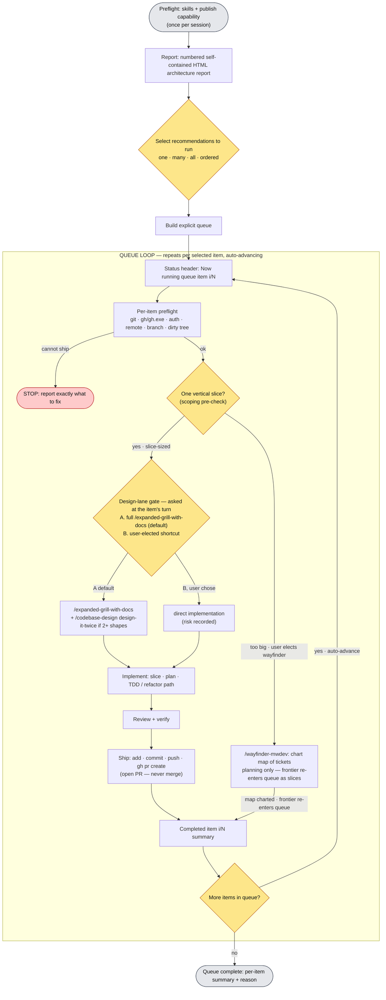

# Production Flywheel

Use this skill as the production delivery command. It generates an architecture report, asks **which recommendations you want to run** (one, several, all, or an explicit order), builds a **visible queue**, then processes that queue **sequentially and automatically** — running preflight, the design-lane gate, the design process, implementation, tests, and PR creation for each item, then advancing to the next item **without stopping to ask**.

The queue is the point. Once you select an ordered batch, that selection authorizes the assistant to work the whole batch end-to-end. It stops only when the queue is complete or a real blocker prevents safe delivery.



Preflight (S0) runs once per session for skills and baseline publish capability. Everything inside the box repeats per selected queue item. Two inner loops still nest inside delivery: the **TDD loop** cycles per behavior, and its **failure interrupt** diverts to `/diagnosing-bugs-mwdev` when a task goes red, flaky, slow, or unexplained, then resumes.

## Model invocation policy

This skill is model-invokable only inside an existing authorization: the user asked for production-flywheel, or an approved implementation contract / selected candidate needs end-to-end delivery. Never self-invoke to start a new repo-wide report, pick a batch, or build a queue — the user starts the flywheel and selects the queue. When invoked with a contract or selected candidate already in hand — including candidates the user selected from a family candidate ledger (`REPORT-SCORING.md` schema, e.g. out of a `--parallel-report` run) — treat the user's selection as the queue and skip the report stage; the report exists to create a queue the user hasn't yet selected. Ledger candidates arrive with lane evidence, scores, and blockers: carry them into the item's design gate instead of rediscovering them, and treat a non-empty `blocked_by` as a real blocker for that item.

## Hard Rules

- Run dependency preflight before starting. Do not silently improvise missing routed skills.
- Produce the numbered HTML architecture report first — unless the invocation arrives with an approved contract or already-selected candidates (see *Model invocation policy*), which stand in for the report stage. Either way, do not change production code before an explicit user selection exists.
- **Ask which recommendations to run.** After the report, the user picks one item, multiple items, all items, or a specific order. That selection becomes an explicit, visible queue.
- **Process the queue sequentially and automatically.** After the batch is selected, work each item end-to-end and advance to the next on your own. **Do not stop after each PR to ask whether to continue.** Stop only when the queue is empty or a real blocker appears.
- **`/expanded-grill-with-docs` is the default design lane, always.** "The design seems obvious / fleshed out / mechanical" is **not** permission to skip it. See *The design-lane gate is never the model's to skip*.
- **The assistant may not silently elect a fast path.** It must never decide on its own that the design contract is complete, that direct delivery is allowed, that a lightweight lane applies, or that `/expanded-grill-with-docs` or the design-it-twice pass in `/codebase-design` is unnecessary. It may *recommend* a shortcut, but the user must choose it. The default/first option is always the full process.
- Ask the design-lane question **when the item reaches its turn in the queue**, not five times upfront — unless the user asks to decide all lanes ahead of time.
- **Scope each candidate before its gate.** If a candidate is too big for one vertical slice, it isn't gate-ready — recommend the **user-elected** `/wayfinder-mwdev` branch to decompose it (plan, don't build); its frontier work re-enters the queue as slice-sized items. Never model-elect wayfinding, and never push a too-big candidate straight into implementation. See *The wayfinder branch*.
- Use `/tdd` for new-behavior tasks; use the behavior-preserving **refactor path** (characterize → stay green) for mechanical or consolidation tasks.
- Use `/diagnosing-bugs-mwdev` when work is red, flaky, slow, or unexplained.
- **Ship automatically, at the queue's elected granularity.** After implementation and tests pass, commit and push as part of the item; open the PR per item by default, or per group when the user elected batched shipping (Stage 2) — publishing is the default end of each item or group, not an optional add-on.
- **"Ship" means open a PR. Never merge.** Do not merge a PR unless the user explicitly says merge.
- Do not claim completion until verification passes. If the standard runner cannot exercise the slice, build a red-capable harness — do not guess.
- Capture durable knowledge in one authoritative place.
- Per-item preflight must confirm the repo can actually ship a PR **before implementation begins** for that item. If it cannot, stop and say exactly what to fix.

## The design-lane gate is never the model's to skip

This is the rule the whole workflow exists to enforce.

The default design lane for **every** selected item is:

```text
Run /expanded-grill-with-docs.
```

A shortcut (direct implementation with no grill) is allowed **only when the user explicitly chooses it at the item's turn.** The assistant:

- must present the full `/expanded-grill-with-docs` lane as option **A**, the default and first option
- may present a shortcut as option **B** and may recommend it with reasoning
- **must not choose B on the user's behalf**, and must not treat "this design looks complete" as authorization to skip grilling
- if the user picks B, records that the user explicitly elected the shortcut and states the risk being accepted

There is no model-elected "design contract is complete," "direct delivery is allowed," "lightweight lane applies," or "grill/design-it-twice is unnecessary." Those decisions belong to the user.

## The wayfinder branch — a candidate too big for one slice

The flywheel's unit is **one vertical slice per item**. Most report candidates fit that. Some don't: an `unresolved` candidate can be a multi-session architectural change with interdependent unknowns — too big to grill into a single slice contract, and too foggy to slice at all.

That candidate is not ready for the A/B design-lane gate. Route it to `/wayfinder-mwdev` **to plan, not to build**: wayfinder charts the candidate as a map of agent-sized investigation tickets with blocking relationships, resolved one per session (its own tickets route to `/research`, `/prototype`, `/expanded-grill-with-docs`, and `/domain-modeling`). Wayfinder produces **decisions, not deliverables** — it sits upstream of implementation, never inside it.

When the map's frontier yields concrete, slice-sized work, those items re-enter this flywheel's queue (or `/to-tickets`) and each passes the normal per-item A/B design-lane gate. Wayfinding does not replace the grill: a slice that emerges still gets grilled at its turn.

**This branch is user-elected, never model-elected.** Like the A/B gate, the assistant may *recommend* wayfinding a candidate it judges too big, but the user chooses it. Charting a map is a scoping decision, not a shortcut — it adds planning rigor rather than skipping it.

## Human Input Gate Rule

Selecting the ordered batch **is** the human authorization for the whole queue: the assistant works every selected item end-to-end and auto-advances between them without re-asking.

Within that authorization:

- The **design-lane A/B question is a required per-item gate** — the user answers it (A or B) when the item reaches its turn. The assistant never answers it for them.
- The **scoping/wayfinder election is user-elected**, like the A/B gate: the assistant may recommend wayfinding a too-big candidate but never charts a map, nor pushes the candidate into implementation, on the user's behalf.
- **Never merge a PR** without an explicit "merge" from the user. Opening the PR is authorized by batch selection; merging is not.
- A **real blocker** (can't ship, unresolved failing verification, irreversible/high-risk decision surfaced mid-item) pauses the queue and asks. A finished PR is not a blocker — keep going.
- If the user is unavailable at the design-lane gate, do **not** silently pick B. Hold the item (and the queue) and report what's needed. The full-grill default is only "safe to auto-proceed" if the user has pre-authorized A for the batch.

## Stage 0 — Dependency & publish preflight (once per session)

### Skill dependency preflight

Check whether the required routed skills are available in the current agent environment before beginning.

Required:
- `improve-codebase-architecture-mwdev`
- `expanded-grill-with-docs`
- `to-tickets` or Slice Contract fallback
- `tdd`
- `diagnosing-bugs-mwdev`

Conditional:
- `codebase-design` (design-it-twice technique)
- `codebase-integrity-audit-loop` (source of `--parallel-report` ledger candidates; the family scoring spine is `shared/candidate-ledger-spine`)
- `wayfinder-mwdev` (decompose a candidate too big for one slice — see the wayfinder branch)
- `research`, `domain-modeling` (support the wayfinder branch's ticket types; the grilling and design types both resolve through `expanded-grill-with-docs`, already Required above)
- `prototype`
- `triage`
- `writing-plans`
- `executing-plans`
- `subagent-driven-development`
- `requesting-code-review`
- `receiving-code-review`
- `verification-before-completion`
- `land-pr` (publish helper — Stage 13 opens each item's PR via `/land-pr`; `/land-prs` lands leftover open PRs as one confirmed batch)

Fallback rule: if a required or conditional skill is not installed as a routed command but its `SKILL.md` can be read from `$HOME/.agents/skills/<skill-name>/SKILL.md`, read that file and follow it directly, and say so explicitly: "The routed command isn't installed here, but I found the shared skill file and will follow it directly."

Gate: every required skill is available as a routed command, or its shared `SKILL.md` was read directly, or a named fallback is stated. If a required skill is missing with none of those, stop. Do not silently improvise.

### Baseline publish capability

Discovering that `gh` or push auth is missing when it's time to ship is too late. At session start, classify baseline publish capability so the user knows the ceiling before any work begins:

- `publish-capable`: remote exists, push auth works or is expected, PR tooling/auth exists
- `push-only`: push appears possible, but PR creation tooling/auth is missing
- `local-only`: no remote or no push/auth path
- `unknown`: cannot determine safely yet

The authoritative ship check runs **per item** in the per-item preflight (below), because branch/auth/tree state can change between items. This session-level pass is the early-warning: if it already shows `local-only` or missing `gh`, say so now rather than discovering it mid-queue.

## Stage 1 — Report

Run `/improve-codebase-architecture-mwdev`.

Gate:
- A self-contained HTML architecture report exists and its absolute path is printed.
- The report contains **numbered** deepening candidates (`1..N`).
- Each candidate names the module, interface/seam friction, expected leverage, expected locality, and testability impact, scored per the family scoring spine in `shared/candidate-ledger-spine`.
- No production code has changed.
- The report's Mermaid diagrams render without syntax errors, and ugly candidate names do not break the page (the report drives Mermaid through `assets/mermaid-safe.js`).

Then ask which recommendations to run (Stage 2). Do not change production code yet.

## Stage 2 — Batch selection & queue

Ask, verbatim in intent:

```text
Which recommendations do you want to run?

You can answer with:
- one number: 3
- multiple numbers: 1, 4, 5
- ordered sequence: 4 then 1 then 3
- all
```

Parse the answer:

- **one number** → a one-item queue
- **multiple numbers** → a queue in the order given (comma order is the run order)
- **ordered sequence** (`4 then 1 then 3`) → a queue in exactly that order
- **all** → every candidate, in report order (confirm the order if the user didn't specify one)

Then print an explicit, visible queue:

```text
Selected queue:
1. [candidate name]
2. [candidate name]
3. [candidate name]
```

This queue **is** the authorization to proceed through every item automatically. Do not ask "shall I start?" or "shall I continue?" between items.

The queue is editable mid-run: the user can reorder, drop, or insert items at any time (wayfinder frontier work also appends, per Stage 5). Apply the edit at the next item boundary, reprint the updated queue, and keep going — a queue edit is a steering input, not a stop.

### Ship granularity

One PR per item is the default. The user can elect **batched shipping** instead — the whole queue or named groups, each group sharing one branch and one PR — in the selection message or at any item boundary (a granularity change applies only to items not yet shipped). When the queue is long (≈5+ items) or several items look small, confirm granularity at the first natural stop (usually item 1's design-lane question, or the upfront exchange if the user decided all lanes ahead of time) rather than silently defaulting into a PR-per-item run. The model may recommend groupings by module or theme, but the election is the user's — never model-elect batching. Batching moves only *where Stage 13 runs*: every per-item stage and gate still runs per item, and a batched item's completion footer reads `PR: ships with group <name>` until the group PR opens.

### Per-item status header

At the start of each item, print:

```text
Now running queue item 2/5: [candidate name]
```

### Per-item completion footer

At the end of each item, print:

```text
Completed queue item 2/5:
- Branch:
- PR:
- Tests:
- Notes:
Moving to item 3/5.
```

Then move immediately to the next item. Do not ask whether to continue unless there is a real blocker.

### Selected-candidate summary (per item, at its turn)

When an item reaches its turn, summarize it before the design-lane gate:

```markdown
## Selected candidate

**Module/seam:**
**Current friction:**
**Expected leverage:**
**Expected locality:**
**Risk:**
**Staleness:** did earlier queue items ship changes to this candidate's modules? (untouched / touched — summarize)
**Lane recommendation:** full grill (A) / user-elected shortcut (B) / wayfinder (too big for one slice) — with reasoning
```

If earlier items materially changed this candidate's premise, say so and let the user re-confirm, re-scope, or drop it before the gate — do not grill a stale premise. (This is the same staleness rule Stage 14 applies to leftover candidates, applied inside the running queue.)

## The queue loop

For each item in the queue, in order:

1. **Per-item preflight** (Stage 3) — including the GitHub CLI / ship-capability checks.
2. **Scoping pre-check + design-lane gate** (Stage 4) — confirm the candidate is one slice (else recommend `/wayfinder-mwdev` to decompose it); then ask the A/B question and run `/expanded-grill-with-docs` unless the user explicitly picks B.
3. **Design process** (Stage 5) — grill / design-it-twice / prototype / triage as selected, **or** `/wayfinder-mwdev` if the scoping pre-check routed here (planning only — the item exits the loop after charting; its frontier work re-enters the queue as new items, and it never reaches Implement/Ship).
4. **Implement** (Stage 6–9) — slice, plan, deliver via TDD or the refactor path.
5. **Review & verify** (Stage 10–11).
6. **Capture & ship** (Stage 12–13) — capture durable knowledge, then commit, push, open the PR. Never merge.
7. **Advance** (Stage 14) — print the completion footer and move to the next item automatically.

Stop the loop only when the queue is empty or a blocker prevents safe delivery.

## Stage 3 — Per-item preflight

Run before implementation for **each** selected item. Its job: confirm the repo can actually ship a PR, and confirm the working tree is in a known state — before any code changes for this item.

**Wayfinder-bound items:** if the selected-candidate summary (Stage 2) recommended `/wayfinder-mwdev` for this item — planning only, no PR this pass — the ship-capability checks below are **informational, not blocking**; wayfinding opens no PR, so missing `gh`/auth/remote does not stop it. Still run the working-tree check so the map work starts from a known state.

Run these checks (support both `gh` and `gh.exe` on Windows — try `gh`, fall back to `gh.exe`):

```bash
git --version
gh --version          # or: gh.exe --version
gh auth status        # or: gh.exe auth status
git remote -v
git status --short
git branch --show-current
```

Interpret:

- **`git` missing** → hard stop; the workflow can't operate. Tell the user to install Git.
- **`gh` / `gh.exe` missing** → stop before implementing this item and tell the user exactly what to install (GitHub CLI). Do not start work you can't ship.
- **`gh auth status` unauthenticated** → stop and tell the user to run `gh auth login`. Name the exact command.
- **No remote (`git remote -v` empty)** → stop and report; there's nowhere to push a PR. (If the user explicitly wants local-only for this item, record that as a user-elected exception.)
- **Detached HEAD / unexpected branch** → note it; you'll create a fresh feature branch for the slice anyway.

### Working-tree check

Inspect `git status --short` before starting the item:

- **Clean** → proceed.
- **Dirty** → summarize the dirty files and decide whether they are **expected** from this workflow (e.g. an in-progress branch from the previous queue item that was already pushed) or a **blocker** (unrelated uncommitted changes that would contaminate this slice). If it's a blocker, stop and ask; if it's expected and explained, proceed and record why.

Do not defer any of this to ship time. The whole reason it lives in preflight is so the assistant never reaches the end of an item only to discover it cannot open a PR.

Gate:
- `git` present; `gh`/`gh.exe` present and authenticated, or the exact blocker is reported and the queue is paused.
- A remote exists, or a user-elected local-only exception is recorded.
- The working tree state is known and either clean or explained.

## Stage 4 — Design-lane gate (per item, at its turn)

**Mandatory for every item. The default is the full grill. The assistant must not skip it or choose the shortcut on the user's behalf.**

**Scoping pre-check (before the A/B gate).** Confirm the candidate is actually one vertical slice. If it's too big for one slice/session — interdependent unknowns, multi-session architectural scope — it isn't gate-ready: recommend the wayfinder branch to decompose it first, and let the user elect it (see *The wayfinder branch*). Its frontier work re-enters the queue as slice-sized items. Reach the A/B gate below only for slice-sized items.

First classify the candidate as `mechanical` / `partly designed` / `unresolved`, then present the gate verbatim in this shape:

```text
This candidate looks [mechanical / partly designed / unresolved].

Default option:
A. Run full /expanded-grill-with-docs before code.

Optional shortcut:
B. Treat the existing design as sufficient and proceed with direct implementation.

My recommendation:
[explain briefly]

Choose A or B.
```

- **If the user chooses A** → run `/expanded-grill-with-docs`. If multiple interface shapes remain plausible, run the design-it-twice pass in `/codebase-design` (see its `DESIGN-IT-TWICE.md`).
- **If the user chooses B** → record explicitly: "User elected the direct-implementation shortcut for this item," and state the risk being accepted (what grilling would have de-risked). Then proceed to implementation.
- **If the user doesn't answer** → hold this item. Do not pick B. (Only auto-run A if the user pre-authorized "A for the whole batch.")

There is no third, model-elected path. Do not infer B from the design looking complete.

## Stage 5 — Design process

Run the lane the gate selected. **A is the default lane; Prototype and Triage are sub-lanes of A**, entered by their triggers rather than a separate gate question — pick Prototype when state/model/UI must be *felt*, Triage when the work starts from an existing issue/PR, otherwise grill. Wayfinder is entered only when the scoping pre-check routed here; B only when the user elected it at the gate.

- **A (default) — grill:** Run `/expanded-grill-with-docs`. See [branches/design.md](branches/design.md). If 2+ interface shapes are plausible, run the design-it-twice pass in `/codebase-design` (see its `DESIGN-IT-TWICE.md`).
- **Prototype** (sub-lane of A, when state/model/UI must be felt): Run `/prototype`. See [branches/prototype.md](branches/prototype.md).
- **Triage** (sub-lane of A, when work starts from an issue/PR): Run `/triage`. See [branches/triage.md](branches/triage.md).
- **Wayfinder (user-elected, pre-slice):** the scoping pre-check found the candidate too big for one slice. Run `/wayfinder-mwdev` to chart it into a map of tickets; planning only. **This item exits the queue loop here — do NOT proceed to Stage 6 (Slice) or Stage 13 (Ship).** Append any concrete, slice-sized frontier work to the queue as new items, print the completion footer (noting the map + tickets created instead of a PR), and auto-advance to the next item. See *The wayfinder branch*.
- **B — user-elected direct implementation:** proceed to Stage 6. Allowed **only** because the user chose B at the gate.

Gate:
- The chosen lane's procedure is complete, or the user's B election is recorded with its risk.
- Interface/seam direction, behavior change, acceptance criteria, out-of-scope boundaries, dependency strategy, and capture needs are explicit before implementation.
- **Wayfinder items** end the loop iteration at map creation (no Stage 6+): the gate is that the map exists, its frontier is wired, and any slice-sized frontier work has been appended to the queue.

## Stage 6 — Slice

Run `/to-tickets` unless the work is already one clear vertical slice. Otherwise write a Slice Contract:

```markdown
## Slice Contract

**Behavior to change:**
**Public interface / user-visible surface:**
**Acceptance criteria:**
**Out of scope:**
**Verification command(s):**
**Capture needs:**
```

Gate: one tracer-bullet vertical slice, independently verifiable, adjacent work explicitly out of scope, acceptance criteria testable.

## Stage 7 — Worktree

Run `using-git-worktrees` for isolated delivery when available.

Branch base: cut each item's branch from the repo's default branch. If this item depends on an earlier queue item whose PR is still unmerged, branch from that item's branch instead, say so in the status header, and note in the PR body that it is stacked and merges after its parent. In batched mode the group shares one branch cut from the default branch: record the branch SHA at each item's start as that item's **baseline**, keep commits per-item so item boundaries stay legible and bisectable, and note that intra-group dependencies need no stacking — later items simply land on the same branch.

Gate: an isolated branch/worktree exists (or the reason not to is documented); the working tree starts clean; baseline verification commands are known and have run, or the reason they can't is documented.

Worktree/plan ordering: creating a branch/worktree is a repo mutation. If the user hasn't approved that mutation, preview the plan first (`plan preview → approval → worktree → finalized plan → execute`); otherwise `worktree → plan → execute`.

## Stage 8 — Plan

Run `writing-plans`.

Gate: the plan is ordered tasks, each mapping to the slice, each with a verification step, none expanding into adjacent cleanup. Select execution mode: `executing-plans` (sequential) or `subagent-driven-development` (independent tasks).

## Stage 9 — Execute & delivery loop

Run `executing-plans` or `subagent-driven-development` per the selected mode. Choose the delivery path per task.

**New behavior path** — the slice adds/changes observable behavior. Run `/tdd`:

```text
one behavior test → red → minimal implementation → green → refactor while green → task verification
```

Gate per task: behavior tested through the public interface; internal modules not mocked; test went red before green unless impossible (documented); refactor only while green; task verification passes.

**Refactor path** — the slice preserves behavior while changing structure:

```text
characterize existing behavior → green baseline → refactor → stay green → task verification
```

Gate: behavior characterized before change; green before refactor; green after; any divergence treated as a failure interrupt; no new behavior added unless it becomes an explicit acceptance criterion.

**Failure interrupt:** if work is broken, red, flaky, slow, or unexplained, pause and run `/diagnosing-bugs-mwdev` (red-capable loop, minimized failure, regression test at the right seam, cleanup), then resume.

## Stage 10 — Review

Run `requesting-code-review`, then `receiving-code-review` on the output.

Gate: critical/high-confidence issues fixed; false positives documented briefly; deferred issues captured as follow-ups; tests rerun after review fixes.

## Stage 11 — Verify

Run `verification-before-completion` if available; otherwise perform the gate manually — do not skip it.

Gate: tests pass; typecheck/lint/build pass if available; acceptance criteria checked one by one; no debug logs, temp harnesses, stale prototypes, or accidental artifacts remain.

**Verification escape hatch:** if the standard runner can't exercise the slice (DB, external APIs, queues, migrations, deploy-only, CLI bridges), build the smallest red-capable harness that reaches the changed behavior. Gate: the harness reaches the changed path, fails before the fix, passes after; setup documented; temp harness deleted or promoted to a real test; evidence explains why the standard runner was insufficient.

## Stage 12 — Local completion & capture

Record a provisional delivery status: `complete-local`, `complete-published`, `blocked-after-delivery`, or `stopped-before-delivery`. This is coarse and temporary — Stage 13 assigns the final, authoritative **publish status** from its enum, and that value supersedes this one. List every changed file and why; list exact verification commands and observed results; check each acceptance criterion pass/fail/blocked.

Capture durable knowledge in one authoritative place:

| Knowledge | Home |
| --- | --- |
| Domain language | `CONTEXT.md` |
| Hard-to-reverse trade-off decision | `docs/adr/` |
| Rejected enhancement concept | `.out-of-scope/` |
| Implementation contract | issue or agent brief |
| Verification evidence | PR body (or Local Completion document) |

## Stage 13 — Ship (automatic; open PR, never merge)

Shipping runs **automatically** once implementation and tests pass — it is the default end of each item, not a separate request. Prefer `/land-pr` when available; otherwise perform the steps directly:

```bash
git status --short
git add <paths for this slice>
git commit -m "<concise, scoped message>"
git push -u origin <branch>
gh pr create --fill   # or with an explicit --title/--body; use gh.exe on Windows if needed
```

Rules:

- **Open the PR. Do not merge it.** Merging requires an explicit "merge" from the user. `gh pr merge` is out of scope here.
- The PR body covers what changed, why, how tested, architecture impact, agent-readability impact, and risks/follow-ups.
- **If `gh pr create` fails**, report the failure clearly and **leave the branch pushed** if the push succeeded. Give the user the exact remote branch URL and the manual PR-creation step. Classify as `pushed-pr-pending`.

Batched groups (user-elected, Stage 2): commit and push per item onto the group branch, but run PR creation **once per group**, after the group's final item completes Stage 12 — PR titled for the group, body summarizing each item. A completed-but-unshipped item carries `pushed-pr-pending` until the group PR opens, then its status becomes `complete-published`. If an item blocks or is abandoned mid-implementation, reset the group branch to that item's baseline SHA (Stage 7) so half-done work never rides along, record that item's blocked status, and continue — the group PR ships the completed subset.

Publish status must be one of: `complete-published`, `pushed-pr-pending`, `complete-local-user-deferred`, `blocked-no-remote`, `blocked-no-auth`, `blocked-no-gh`, `blocked-verification`, `stopped-before-delivery`.

Gate if publishing succeeds: branch committed, pushed, PR exists (open, not merged), PR body complete, stale refs/branches cleaned up.
Gate if PR creation is blocked after push: branch pushed, remote URL provided, exact blocker named, manual PR step given, status `pushed-pr-pending`.

Note: the per-item preflight (Stage 3) should have already caught missing `gh`/auth/remote. If ship fails anyway, it's a genuine blocker — report it and decide whether the queue can safely continue to the next item (usually it can; a per-item ship failure doesn't have to abort the whole queue).

## Stage 14 — Advance the queue

Print the per-item completion footer (Stage 2), then move to the next item **automatically**:

```text
Completed queue item 2/5:
- Branch:
- PR:
- Tests:
- Notes:
Moving to item 3/5.
```

Do not ask whether to continue. Auto-advance until:

- **the queue is empty** → print a final per-item summary (each item's branch/PR/status) and stop — if the run left multiple PRs open, note that `/land-prs` can land them as one confirmed batch — or
- **a real blocker appears** → pause the queue, state which item blocked and why, and ask how to proceed. A pushed PR awaiting review is not a blocker.

When the queue completes, offer to regenerate the report (Stage 1) for a fresh batch if the user wants to keep going — but do not auto-start a new batch; a new batch requires a new selection. Reuse remaining candidates from the prior report only when the shipped slices touched none of the modules they name; otherwise regenerate.

Gate:
- Every selected item ended in a classified state (shipped PR, `pushed-pr-pending`, or an explicitly reported blocker).
- No PR was merged unless the user explicitly said merge.
- The queue stopped only because it was empty or blocked — never merely because a PR was opened.
